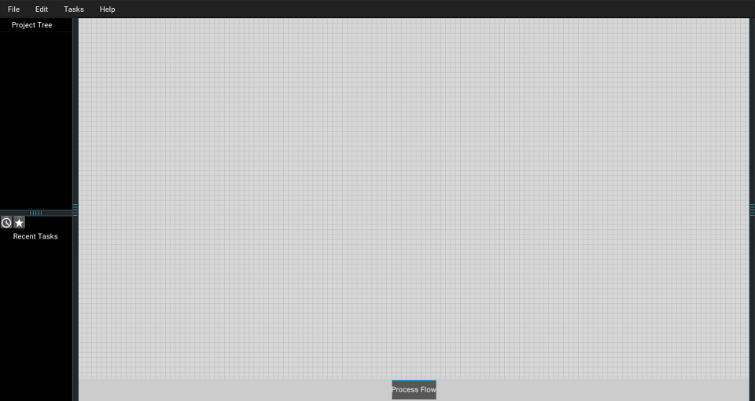
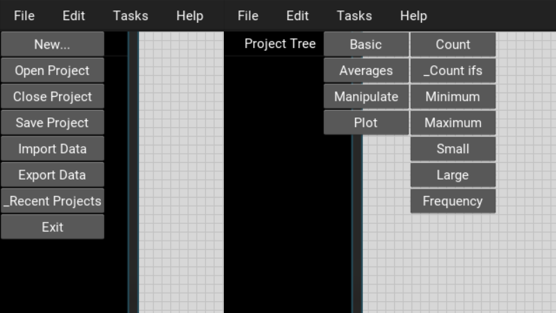
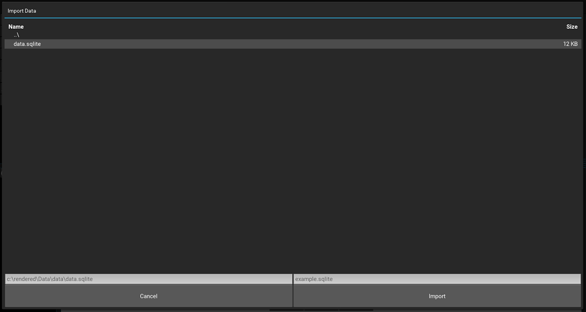
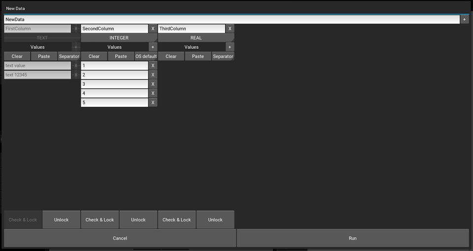
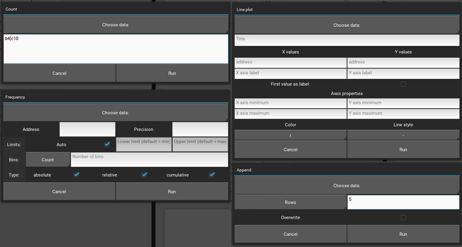
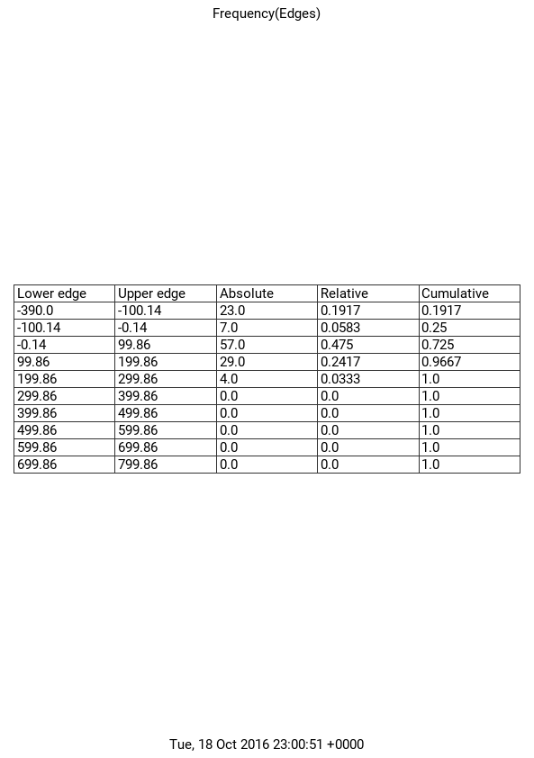
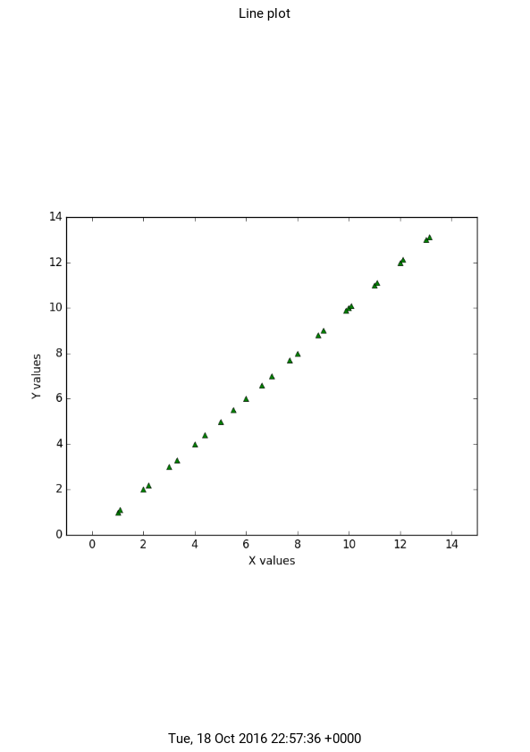
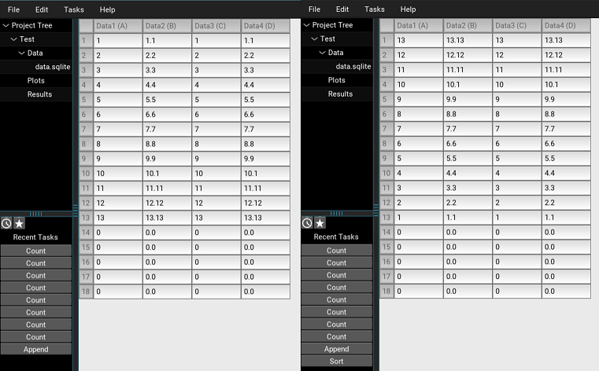
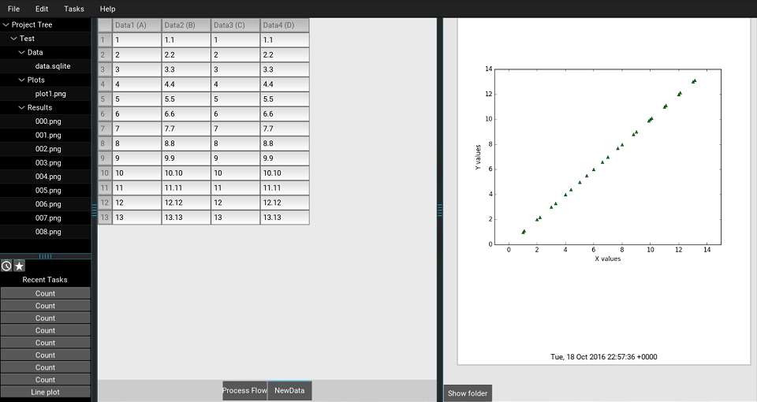

.. _gallery:

Gallery
=======

Although KrySA is still in pre-alpha, it can already do some useful tasks
mentioned in :ref:`task`. This page show a quick peek into how the basic
environment looks and what kind of output you can expect without actually
installing whole application just to try.

Environment
-----------

This is basically the view you get when the application is first launched:

Menus
-----

Most of the menus are in a style of common "dropdown"-like menu:

Open & Import
-------------

When opening a :ref:`project` or importing :ref:`data`, there's a file browser
with settings available to select only files related to the application:

Creating Data
-------------

When creating :ref:`data` from scratch, there's a wizard for that to properly
select each column's type and other necessary stuff. You can paste from
clipboard too e.g. from some spreadsheet application a whole column just by
clicking at ``Paste``:

Tasks
-----

All of the :ref:`task` s are handled via some popup that expects values for the
task to run:

Results
-------

There are various types of results for :ref:`project` such as those drawn to
a paper of 72dpi A4 size or the results that edit actual table they work with.

Text
~~~~

Here is a view of how :ref:`data` are visible in the application together with
just a text (or number) result centered on the page.

.. image:: _static/gallery/04_data_result.png
   :align: center
   :target: _static/gallery/04_data_result.png

Table
~~~~~

A table as a result of `Tasks -> Basic -> Frequency` used with `Edges` in A4
format:

Plot
~~~~

Matplotlib's Pyplot drawn from the table shown before in A4
format:

Data
~~~~

After `Task -> Manipulate -> Append` and `Task -> Manipulate -> Sort`:

Used environment
----------------

At the end your environment might look similar to this screenshot:

